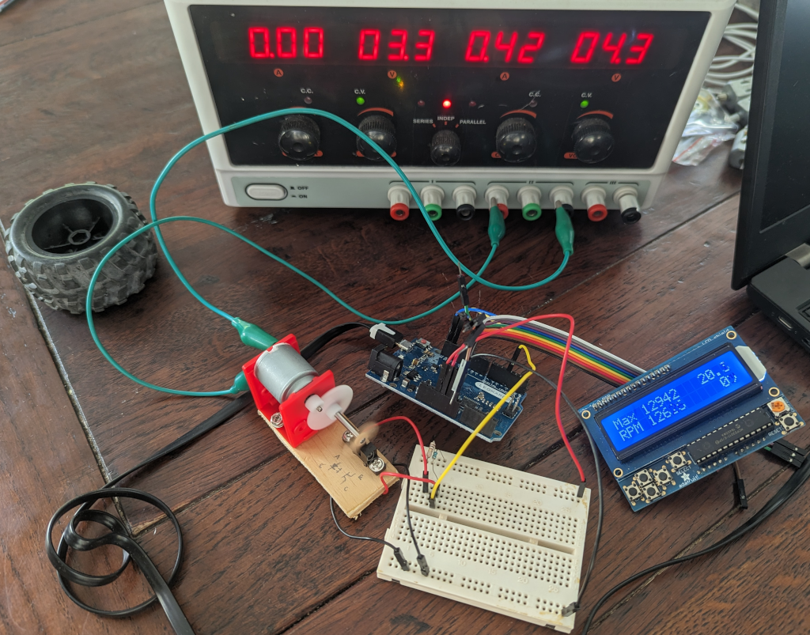
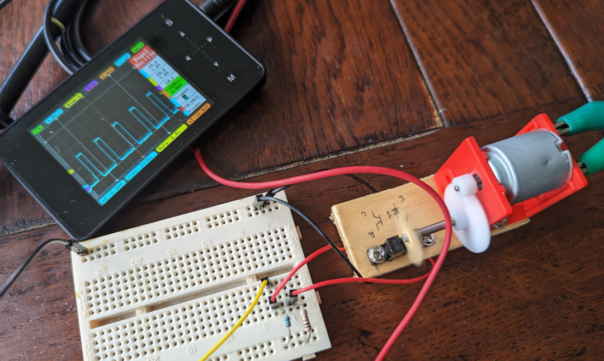
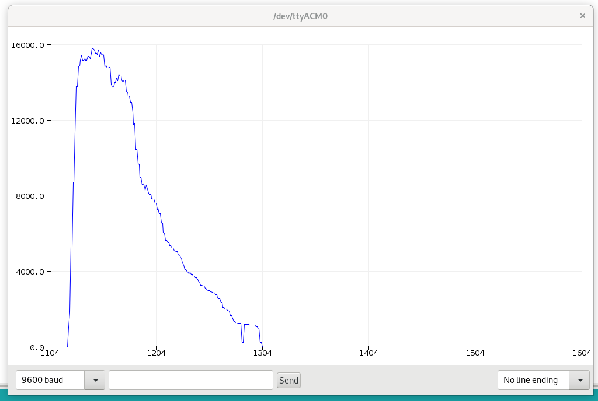

## Arduino Leonardo RPM Measurement

### Summary

Measures the RPM of a 3.3v signal on pin 12.

Displays the result on an Adafruit i2c 16x2 LCD and also outputs it on the
USB/serial connection in a format suitable for the Arduino IDE plotter tool.

### Implementations

*  `using_count`: Count the number of rotations during a period, extrapolate
   for one minute.

### Images

### LCD Shield

Manual and wiring diagram (page 22):

* https://cdn-learn.adafruit.com/downloads/pdf/rgb-lcd-shield.pdf

FAQ:

* https://learn.adafruit.com/rgb-lcd-shield/f-dot-a-q
