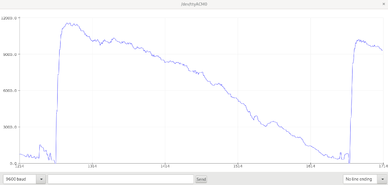
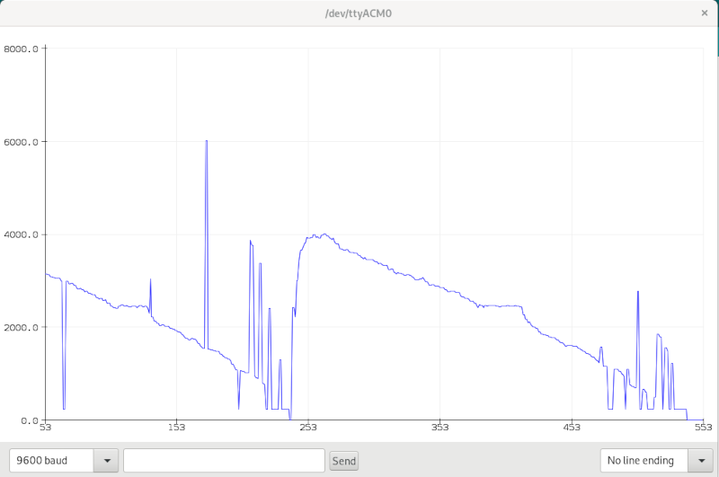

## Arduino Leonardo RPM Measurement

### Summary

Measures the RPM of a 3.3v signal on pin 12 by measuring the time for a
revolution.

Displays the result on an Adafruit i2c 16x2 LCD and also outputs it on the
USB/serial connection in a format suitable for the Arduino IDE plotter tool.

### Pins

* 3.3v: (power out) Sensor power.
* 5v: (power out) LCD shield power.
* gnd: (power out) LCD shield and sensor ground.
* scl: (i2c) LCD shield clock.
* sda: (i2c) LCD shield data.

And one of:

* 4: (Arduino Leonardo ICP1, input) signal being measured.
* 8: (Arduino Uno ICP1, input) signal being measured.

Motor Control

* 6: PWM out to ramp motor from fast to slow.

### Timer Theory

Timer/counter 1 is configured to run at 250kHz.

A rising edge on ICP1 (pin 4 on the Leonardo) causes a timer 1 capture.

The captured value multiplied by 1/250,000 to calulate revolutions per second,
which is multiplied by 60 to get RPM.

### Motor Control

In order to test the reliability of measurements at different speeds there
is a PWM ramp on pin 6, starting fast and ramping down.  This was used to
generate the two screenshots below.

To control the motor with this signal, you can use a circuit like this:
https://www.tutorialspoint.com/arduino/arduino_dc_motor.htm

To demonstrate the effect of debouncing and smoothing, here's what low speeds
look like without smoothing enabled:

